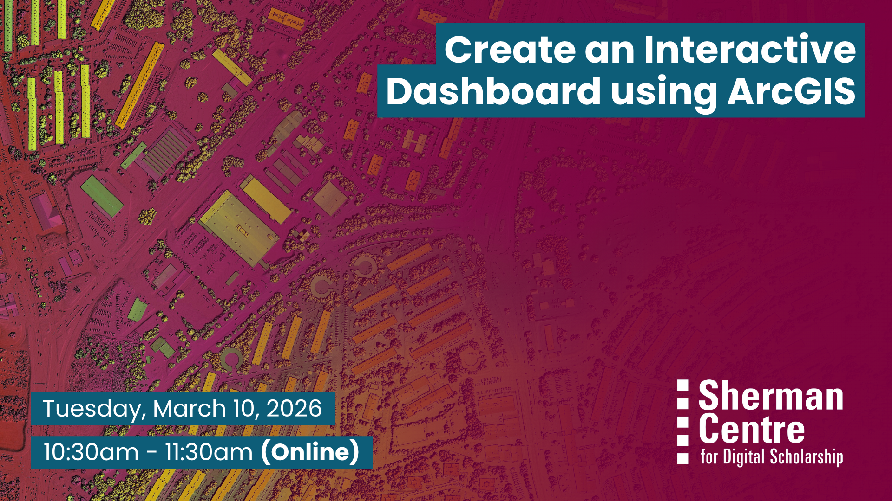

# Create an Interactive Dashboard using ArcGIS

Need to present data in a way that's visual, interactive, and easy to understand? ArcGIS Dashboards lets you combine maps, charts, and text to create web-based dashboards that clearly communicate your data’s story. 

In this beginner-friendly workshop, you'll learn how to use ArcGIS Dashboards to display and explore openly available data through dynamic maps and charts—no prior experience needed. We will walk through creating a basic map and designing a dashboard that helps convey meaningful information to your audience through clear visual elements.

By the end of the session, participants will be able to:
- Use data from an open data portal to create a map in ArcGIS Online
- Design, build, and publish an interactive dashboard using ArcGIS Dashboards

This session is ideal for anyone looking to present data in clear and engaging ways.

## Workshop Preparation 

To follow along with the workshop, participants will require access to ArcGIS Online. Current McMaster students, staff, and faculty can request a license through the ArcGIS Software Request Form [https://mcmaster-ca.libwizard.com/f/arcgis](https://mcmaster-ca.libwizard.com/f/arcgis).

## Facilitator Bio

Christine Homuth (she/her) is the Library's GIS Specialist, providing support and resources to students, researchers, and faculty members working with Geographic Information Systems (GIS) and geospatial data.

## Workshop Slides

Coming soon.