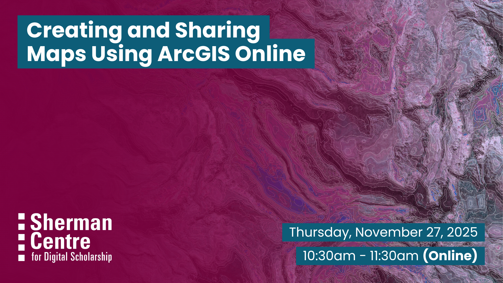

# Introduction to Creating and Sharing Maps Using ArcGIS Online

Want to bring your data to life through interactive maps? This beginner-friendly workshop introduces the fundamentals of Geographic Information Systems (GIS) and geospatial data before guiding you step-by-step through creating your own interactive web map using ArcGIS Online. Perfect for beginners, this session combines essential theory with hands-on practice to help you confidently start mapping online. ArcGIS Online is available free of charge to current students, staff, and faculty at McMaster University for coursework and research.

By the end of the workshop, participants will be able to:
- Explain key concepts of Geographic Information Systems (GIS) and recognize various real-world applications.
- Identify and access reliable sources of geospatial data for mapping projects.
- Create a simple, functional map using ArcGIS Online by applying the skills learned during the workshop.

No prior experience is needed! This session is perfect for beginners interested in mapping who want to learn how to work with geographic data and create digital maps using ArcGIS Online.

Prep: To follow along, participants will need access to ArcGIS Online. Current McMaster students, staff, and faculty can request a license through the ArcGIS Software Request Form (https://mcmaster-ca.libwizard.com/f/arcgis).

## Workshop Preparation

To follow along with the workshop, participants will require access to ArcGIS Online. Current McMaster students, staff, and faculty can request a license through the ArcGIS Software Request Form (https://mcmaster-ca.libwizard.com/f/arcgis).

## Facilitator Bio

Christine Homuth (she/her) is the Library's GIS Specialist, providing support and resources to students, researchers, and faculty members working with Geographic Information Systems (GIS) and geospatial data.

## Workshop Slides

<!-- <embed src="assets/docs/Creating-and-Sharing-Maps-with-ArcGIS-Online.pdf" style="border:none;" width="100%" height="466px">

[Download as PDF.](assets/docs/Creating-and-Sharing-Maps-with-ArcGIS-Online.pdf)-->