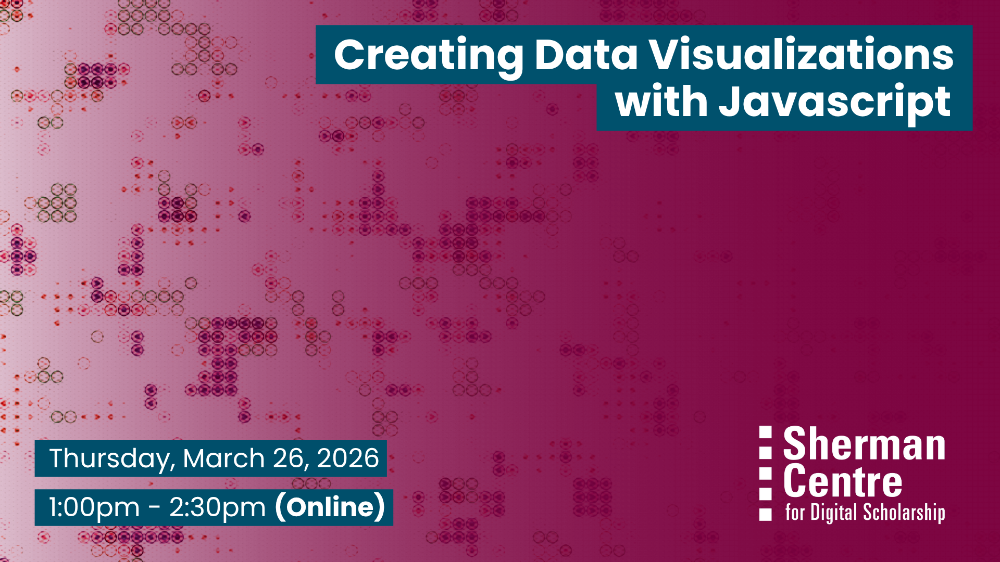

# Data Visualizations with Javascript

Ready to bring your data to life? This hands-on workshop will equip you with the essential skills to transform data into compelling and interactive visualizations using Plotly.js, a powerful open-source graphing library. In this introductory session, we’ll use Plotly to create a range of common chart types and gradually build skills toward more advanced and customized visualizations.

Participants will learn how to: 
- Understand the basic building blocks of creating data visualizations with Plotly.
- Apply Plotly's fundamental syntax to generate distinct chart types from provided datasets, accurately representing the underlying data. 
- Analyze a given dataset and select the most appropriate Plotly chart type for effective visual communication based on data characteristics and visualization best practices.

No prior Plotly experience is required, but basic Javascript familiarity is recommended. This session is ideal for data enthusiasts, researchers, developers, and anyone looking to create dynamic, web-based visualizations to communicate data insights effectively.

## Workshop Preparation 

Download VS Code Editor: [https://code.visualstudio.com/](https://code.visualstudio.com/)

## Facilitator Bio

Subhanya (she/her) brings a background of research in data justice, science and technology studies, and environmental humanities. She is currently thinking through participatory data design which allow for visualizations that are empowering for the end user.

## Workshop Slides

Coming soon.

<!-- <embed src="assets/docs/Creating-and-Sharing-Maps-with-ArcGIS-Online.pdf" style="border:none;" width="100%" height="466px">

[Download as PDF.](assets/docs/Creating-and-Sharing-Maps-with-ArcGIS-Online.pdf)-->