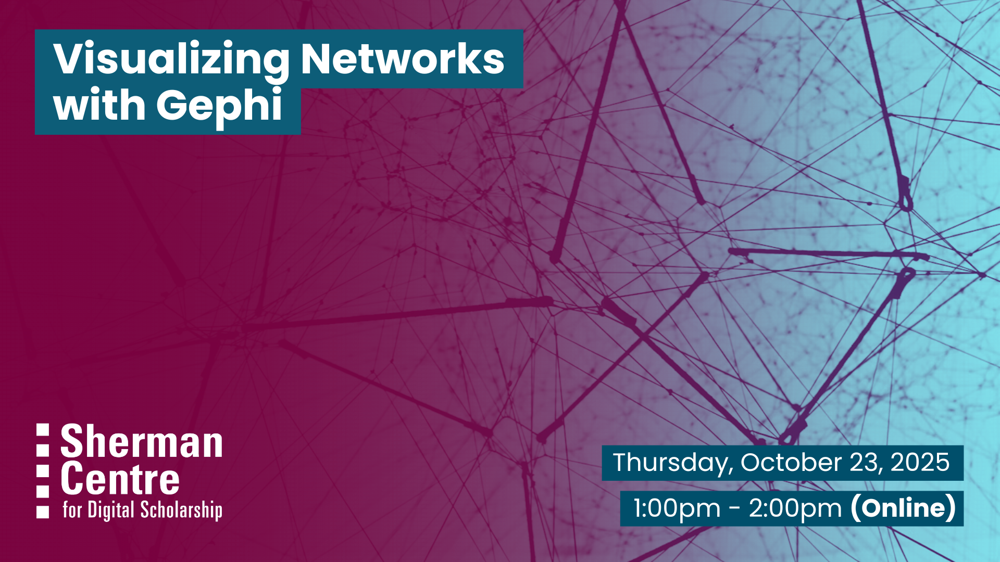

# Visualizing Networks with Gephi

Want to explore how people, ideas, or objects are connected? In this virtual workshop, you will learn how to use Gephi, a free and open-source tool designed for network visualization and analysis. We will focus on how graph data can help express relationships between entities, perfect for exploring everything from social networks to historical connections. 

In this workshop, participants will learn to:
- Import a dataset into Gephi
- Identify key network elements such as nodes and edges. 
- Apply basic layout algorithms (e.g., Force Atlas 2, Fruchterman Reingold) 
- Utilize visual ranking tools (e.g., node size by degree, edge color by weight) to effectively explore and visualize network structures within Gephi.

This session is ideal for anyone curious about visualizing networks—no prior experience with Gephi or network analysis is required! It’s especially useful for humanities scholars interested in exploring relationships in texts, people, or historical data.

## Workshop Preparation 

Install Gephi: [https://gephi.org/](https://gephi.org/)

## Facilitator Bio

Subhanya (she/her) brings a background of research in data justice, science and technology studies, and environmental humanities. She is currently thinking through participatory data design which allow for visualizations that are empowering for the end user.

## Workshop Slides

Coming soon.

<!-- <embed src="assets/docs/Creating-and-Sharing-Maps-with-ArcGIS-Online.pdf" style="border:none;" width="100%" height="466px">

[Download as PDF.](assets/docs/Creating-and-Sharing-Maps-with-ArcGIS-Online.pdf)-->