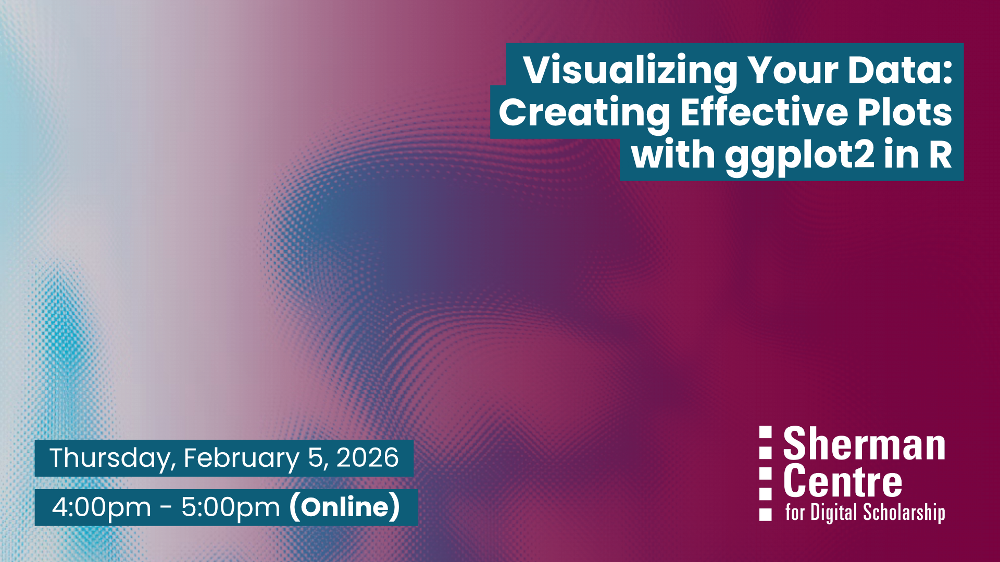

# Visualizing Your Data: Creating Effective Plots with ggplot2 in R

Ever struggled to turn raw data into clear, compelling visuals? Whether you're presenting findings, exploring patterns, or just trying to make your data speak, effective visualization is key. In this workshop, you'll learn how to use ggplot2, a popular R package, to create publication-ready plots that reveal insights and tell stories.

This hands-on workshop introduces ggplot2, a powerful and flexible data visualization package in R based on the grammar of graphics. You’ll learn how to create and customize a variety of plot types—such as bar charts, scatter plots, histograms, and line graphs—while also learning how to choose the most appropriate visualization for different types of data. Whether you’re new to R or want to improve the way you communicate data, this session offers practical guidance and reusable code to get you started.

In this workshop, participants will learn to:
- Describe the key components of the grammar of graphics used in ggplot2
- Apply ggplot2 techniques to effectively communicate data insights in R
- Create basic visualizations such as bar charts, scatter plots, histograms, and line graphs using ggplot2
- Choose appropriate plot types for different kinds of data 
- Customize plots by modifying aesthetics, adding labels, adjusting color schemes, and applying themes

No prior experience with R Studio is required. This workshop is ideal for researchers who are looking to enhance their data storytelling skills through visualization.

## Workshop Preparation 

A working copy of RStudio is required.

## Facilitator Bio

Sahar is a PhD candidate in the Health Research Methodology program at McMaster University with a background in midwifery. She supports researchers in data analysis using statistical software such as R, SAS, and SPSS, research methodology, and evidence synthesis.

## Workshop Slides

Coming soon.

<!-- <embed src="assets/docs/Creating-and-Sharing-Maps-with-ArcGIS-Online.pdf" style="border:none;" width="100%" height="466px">

[Download as PDF.](assets/docs/Creating-and-Sharing-Maps-with-ArcGIS-Online.pdf)-->