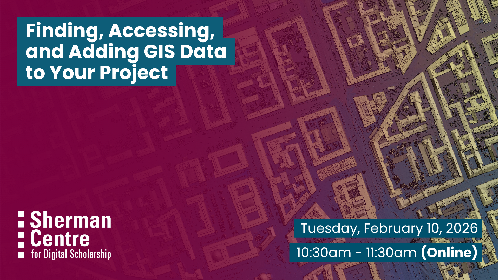

# Finding, Accessing, and Adding GIS Data to Your Project

Looking for data to power your digital mapping project? Geospatial data contains location information and can be mapped using Geographic Information Systems (GIS) software. 
Mapping geospatial data helps us see patterns, create visualizations, and make informed decisions.
This workshop introduces participants to geospatial data formats as well as reliable sources for this data. 

Participants will learn to: 
- differentiate between geospatial data models 
- locate datasets using common sources for geospatial data
- evaluate a dataset for use.

This session is ideal for beginners, researchers, and anyone interested in using location data to enhance their projects. No prior GIS experience is required.

## Workshop Preparation 

None

## Facilitator Bio

Christine Homuth (she/her) is the Library's GIS Specialist, providing support and resources to students, researchers, and faculty members working with Geographic Information Systems (GIS) and geospatial data.

## Workshop Slides

<embed src="assets/docs/GIS Data Workshop Slides-W2026.pdf" style="border:none;" width="100%" height="466px">

[Download as PDF.](assets/docs/GIS Data Workshop Slides-W2026.pdf)