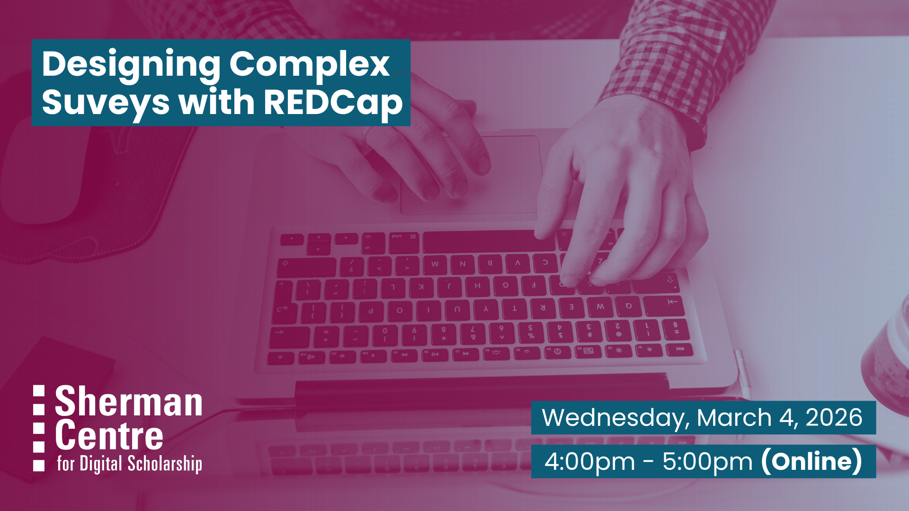

# Designing Complex Surveys with REDCap

Once you move beyond simple surveys, research projects often require more complex designs—such as multiple time points, conditional questions, automated reminders, and validation rules to ensure high-quality data. This intermediate workshop focuses on the advanced functionalities within REDCap that enable researchers to design sophisticated surveys and manage complex study workflows with confidence and efficiency.

This hands-on intermediate workshop builds on basic REDCap skills and introduces advanced tools used to design dynamic surveys and longitudinal research databases. Participants will learn how to implement branching logic and calculations, configure repeating instruments and multiple study events, apply data validation and quality rules, automate survey invitations, manage user permissions, and monitor audit trails for regulatory compliance.

Live demonstrations and guided exercises will help participants translate real study protocols into robust REDCap project designs that support both clinical and population-based research.

By the end of this workshop, participants will be able to:
- Design complex and dynamic surveys using branching logic, piping, and calculated fields
- Build and manage longitudinal REDCap projects with multiple events and repeating forms
- Configure automated survey invitations, alerts, and notifications
- Apply data validation rules and data quality checks to minimize entry errors
- Manage user rights and team permissions for collaborative research projects

## Workshop Preparation 

Participants will need an active REDCap account to participate fully in this workshop, as live navigation and project setup exercises will be included.

A temporary REDCap training account will be created for each registered participant using their McMaster email address. These accounts are intended only for hands-on practice during the session and should not be used for real research data collection.

Please register using your McMaster email address to ensure your REDCap practice account can be created prior to the workshop.

## Facilitator Bio

Shubrandu (he/him) is a PhD candidate in Health Research Methodology (Clinical Epidemiology) at McMaster University with a background in epidemiology and biostatistics. He has extensive experience working with large healthcare datasets and supports researchers in study design, statistical analysis, and data management. His expertise includes regression modeling, survival analysis, and handling administrative health data, with proficiency in R, SAS, and SPSS.
