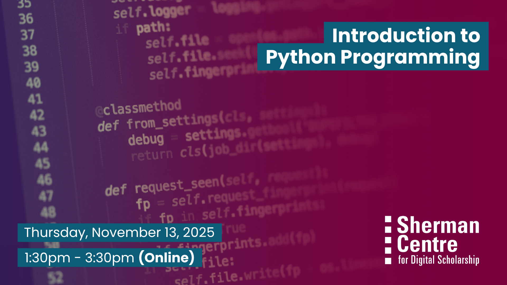

# Introduction to Python Programming (Fall Term)

Interested in learning one of the world’s most popular programming languages? Python is beginner-friendly and widely used across many fields for data analysis, automation, and more.

This hands-on workshop will introduce you to Python’s basic concepts, including data types, variables, and simple operations on numbers and strings. No prior experience with Python is needed.

By the end of this session, participants will be able to:

- Understand fundamental Python data types and variables
- Perform basic operations on numbers and strings
- Write simple Python code to manipulate and store data

This session will be recorded and made publicly available. It’s perfect for anyone looking for a practical introduction to Python programming.

## Workshop Preparation 

McMaster participants will use their MacID to login to McMaster's Jupiter Notebook instance. Non-McMaster participants must have a tool (such as Google Colab, Kaggle Notebooks, PyCharm, Spyder etc.) ready on their system to write Python code.

## Facilitator Bio

Vivek Jadon (he/him) provides research support in the use of numeric research data. As part of his role, Vivek is McMaster University’s official representative for Statistics Canada’s Data Liberation Initiative (DLI) program and Inter-university Consortium for Political and Social Research (ICPSR). Both of these programs provide researchers with vast archive of research data from various disciplines for high quality research and instruction. Vivek is also involved in building awareness and promoting RDM activities/services at McMaster.

## Workshop Slides

Coming soon.

<embed src="assets/docs/Introduction-Python-Programming_NOV-13-2025.pdf" style="border:none;" width="100%" height="466px">

[Download as PDF.](assets/docs/Introduction-Python-Programming_NOV-13-2025.pdf)