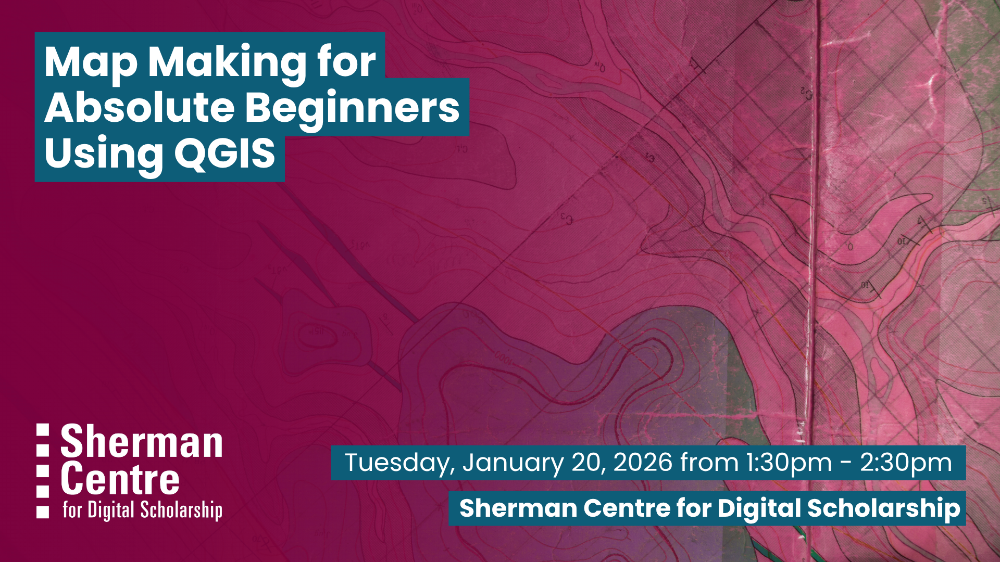

# Map Making for Absolute Beginners Using QGIS

Interested in digital mapping, but unsure of where to start? This beginner-focused workshop introduces you to the fundamentals of geographic data and teaches you how to create digital maps using QGIS, a free and open-source geographic information system (GIS). QGIS is available free of charge to everyone, including current students, staff, and faculty at McMaster University. It’s a great starting point for anyone looking to explore mapping in their research, projects, or creative work.

By the end of this workshop, participants will be able to:
- Describe what geographic data is and explain the basic functions of geographic information systems (GIS).
- Identify and navigate the main components of the QGIS graphical user interface.
- Access and use geospatial web services within QGIS.
- Understand the purpose of coordinate reference systems and apply them in QGIS.
- Create a basic map layout using the QGIS print layout tool.

Absolutely no geography or quantitative background is necessary for an engaging experience. This session is great for beginners who are curious about mapping and want to explore how geographic data can be used to create digital maps with QGIS.

## Workshop Preparation 

Download latest (long-term release) version of QGIS: [https://qgis.org/download/](https://qgis.org/download/)

Specific notes for mac os users: The first launch of application may fail due to Apple’s security framework. Can follow this workflow: (https://qgis.org/resources/installation-guide/#mac-os-x--macos)[https://qgis.org/resources/installation-guide/#mac-os-x--macos]

Saman will be available 30 mins before workshop to help troubleshoot.

## Facilitator Bio

Saman’s (she/her) work operates at the intersection of information science and critical geography. She’s particularly interested in the ways in which community-owned and -governed infrastructure can contribute to equitable knowledge systems. Currently, Saman takes care of McMaster’s Lloyd Reeds Map Collection, ensuring community members are able to access, understand, and use the collection for teaching and research.

## Workshop Slides

Coming soon.

<!-- <embed src="assets/docs/Creating-and-Sharing-Maps-with-ArcGIS-Online.pdf" style="border:none;" width="100%" height="466px">

[Download as PDF.](assets/docs/Creating-and-Sharing-Maps-with-ArcGIS-Online.pdf)-->