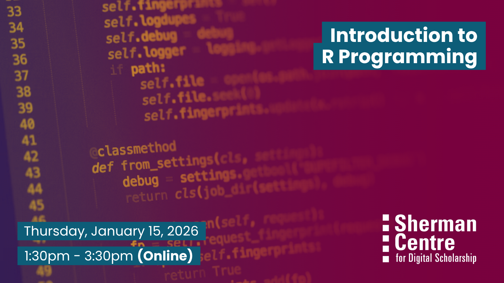

# Introduction to R Programming (Winter Term)

Curious about R but not sure where to start? This beginner-friendly workshop is designed for those with no prior experience in R programming. You’ll get hands-on with RStudio, explore key data types and data structures, and learn how to perform basic data manipulation. By the end, you’ll be able to write and run your own R scripts with confidence.

This session will take place synchronously and will be recorded and shared publicly for future reference.

In the workshop, participants will learn to:
- Navigate the RStudio environment
- Understand and use basic data types and structures in R
- Write and run simple R scripts
- Perform basic data manipulation tasks

Whether you're working with data in the sciences, humanities, or social sciences, this workshop offers a strong foundation to begin your R programming journey.

## Workshop Preparation 

A working copy of R Studio is required on participants laptops.

## Facilitator Bio

Vivek Jadon (he/him) provides research support in the use of numeric research data. As part of his role, Vivek is McMaster University’s official representative for Statistics Canada’s Data Liberation Initiative (DLI) program and Inter-university Consortium for Political and Social Research (ICPSR). Both of these programs provide researchers with vast archive of research data from various disciplines for high quality research and instruction. Vivek is also involved in building awareness and promoting RDM activities/services at McMaster.

## Workshop Slides

Coming soon.

<!-- <embed src="assets/docs/Creating-and-Sharing-Maps-with-ArcGIS-Online.pdf" style="border:none;" width="100%" height="466px">

[Download as PDF.](assets/docs/Creating-and-Sharing-Maps-with-ArcGIS-Online.pdf)-->