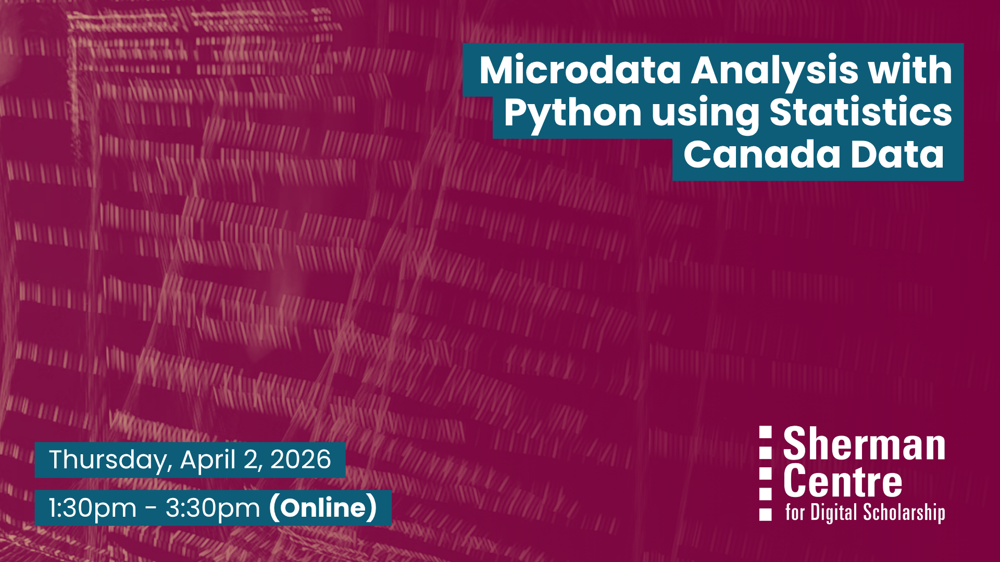

# Introduction to REDCap for Electronic Data Collection

Are you collecting research data and looking for a secure and efficient way to manage it? This beginner-friendly workshop introduces REDCap (Research Electronic Data Capture), a web-based application designed to support data collection for research projects of all sizes. Whether you are running a small survey or coordinating a multi-site study, this session will help you learn how REDCap can simplify data collection, ensure data quality, and make your research workflow more organized and reproducible.

This hands-on introductory workshop guides participants through the essential features of REDCap, a secure and user-friendly platform for building and managing online surveys and databases. Participants will learn how to design and distribute surveys, navigate core project settings, explore basic data monitoring and quality tools, and export datasets for analysis.
The session emphasizes practical learning through step-by-step demonstrations and live practice activities so participants can confidently create their own REDCap projects. No prior experience with REDCap or database tools is required. Participants who wish to practice building a survey during the session will need access to a REDCap account.

By the end of this workshop, participants will be able to:
- Describe the purpose and key features of REDCap for research data collection
- Build and customize a basic survey or data collection form
- Navigate core project settings and project workflows
- Distribute surveys using public links or automated invitations
- Perform basic data review and simple analysis within REDCap
- Export project data for analysis in R, SAS, SPSS, or Excel
- Recognize how REDCap supports secure, organized, and reproducible research workflows

## Workshop Preparation 

Participants will need an active REDCap account to participate fully in this workshop, as live navigation and project setup exercises will be included.

A temporary REDCap training account will be created for each registered participant using their McMaster email address. These accounts are intended only for hands-on practice during the session and should not be used for real research data collection.

Please register using your McMaster email address to ensure your REDCap practice account can be created prior to the workshop.

## Facilitator Bio

Shubrandu (he/him) is a PhD candidate in Health Research Methodology (Clinical Epidemiology) at McMaster University with a background in epidemiology and biostatistics. He has extensive experience working with large healthcare datasets and supports researchers in study design, statistical analysis, and data management. His expertise includes regression modeling, survival analysis, and handling administrative health data, with proficiency in R, SAS, and SPSS.

## Workshop Slides

Coming soon.

