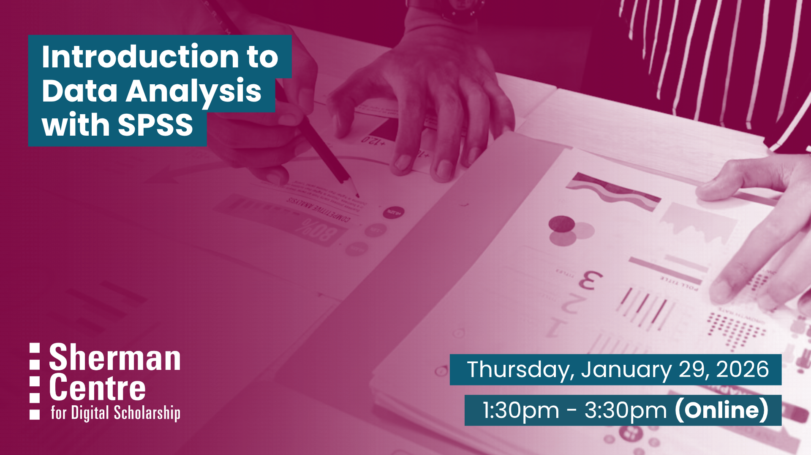

# Introduction to Data Analysis with SPSS (Winter Term)

<!-- Title in spreadsheet says Analyzing Data with SPSS? -->

Looking for an accessible way to analyze data? SPSS is a widely used statistical software that makes it easy to explore, summarize, and interpret data—no programming required.

This beginner-friendly workshop introduces SPSS through hands-on activities using its point-and-click interface. You’ll learn how to import data, run basic descriptive statistics, and perform simple analyses like t-tests and correlations.

By the end of this session, participants will be able to:

- Navigate the SPSS interface and load data

- Run descriptive statistics such as means, frequencies, and standard deviations

- Conduct basic statistical tests (e.g., t-tests, correlations)

- Interpret and export results from SPSS

This session is ideal for students, researchers, and staff who want a user-friendly introduction to statistical analysis. No prior experience required!

## Workshop Preparation 

A working copy (either trial version or licensed copy) of SPSS is required on participants laptops.

## Facilitator Bio

Vivek Jadon (he/him) provides research support in the use of numeric research data. As part of his role, Vivek is McMaster University’s official representative for Statistics Canada’s Data Liberation Initiative (DLI) program and Inter-university Consortium for Political and Social Research (ICPSR). Both of these programs provide researchers with vast archive of research data from various disciplines for high quality research and instruction. Vivek is also involved in building awareness and promoting RDM activities/services at McMaster.

## Workshop Slides

<embed src="assets/docs/IntroductiontoSPSS-January-2026.pdf" style="border:none;" width="100%" height="466px">

[Download as PDF.](assets/docs/IntroductiontoSPSS-January-2026.pdf)

## Workshop Recording

<iframe height="416" width="100%" allowfullscreen frameborder=0 src="https://echo360.ca/media/6488cb8f-4558-4c3d-b93f-45551f1e5b79/public"></iframe>
[View original here.](https://echo360.ca/media/6488cb8f-4558-4c3d-b93f-45551f1e5b79/public)

