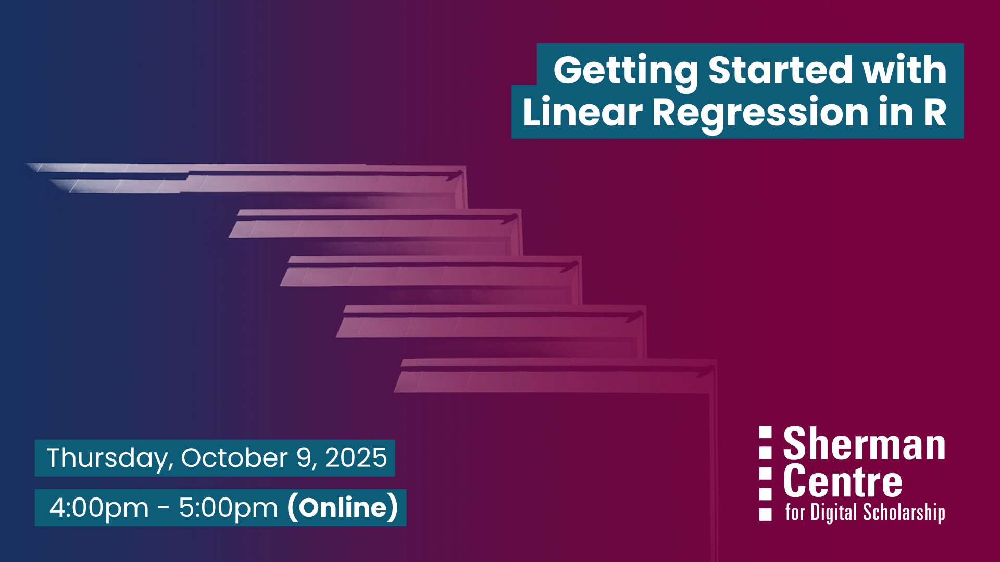

# Getting Started with Linear Regression in R

Curious about uncovering patterns in your data? Whether you're investigating how income relates to education or how age and location affect voting behaviour, linear regression helps quantify and interpret relationships between variables.

This hands-on, intermediate-level workshop introduces linear modeling in R, a powerful and open-source tool for statistical analysis. You’ll learn how to fit a linear model, interpret coefficients, assess model assumptions, and evaluate model performance using diagnostic plots like residuals.

By the end of this session, participants will be able to:

- Fit a linear regression model using R

- Interpret key output from a linear model

- Check model assumptions and explore diagnostic plots

- Apply linear modeling techniques to real-world data

This session is best suited for participants who have some prior experience using R and are ready to expand their skills into statistical modeling.

## Workshop Preparation 

A working copy of RStudio is required.

## Facilitator Bio

Sahar Khademioore

Sahar is a PhD candidate in the Health Research Methodology program at McMaster University with a background in midwifery. She supports researchers in data analysis using statistical software such as R, SAS, and SPSS, research methodology, and evidence synthesis.

## Workshop Slides

Coming soon.

<!-- <embed src="assets/docs/Creating-and-Sharing-Maps-with-ArcGIS-Online.pdf" style="border:none;" width="100%" height="466px">

[Download as PDF.](assets/docs/Creating-and-Sharing-Maps-with-ArcGIS-Online.pdf)-->