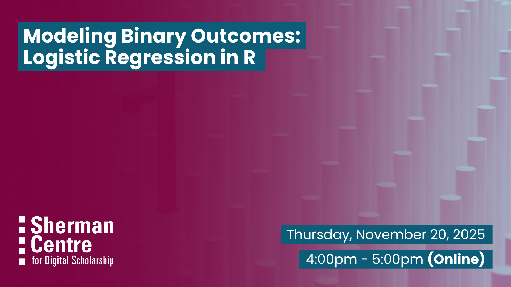

# Modeling Binary Outcomes: Logistic Regression in R

Do you want to analyze outcomes like disease presence, voting behavior, or customer churn? Logistic regression is a powerful method for modeling binary outcomes and understanding how different factors influence the likelihood of an event. In this hands-on workshop, you’ll learn how to use R to build and interpret logistic regression models, helping you make informed decisions based on your data.

This workshop introduces logistic regression using R, with a focus on practical applications and interpretation. In this session, participants will:

- Understand foundational concepts of logistic regression

- Learn how to structure and prepare data for logistic regression analysis

- Use the glm() function in R to fit multiple logistic regression models

- Interpret model coefficients, including odds ratios

- Evaluate the performance and fit of logistic regression models

This session is ideal for participants who have some experience with R and are ready to explore statistical modeling in a supportive, practical setting. Attending the linear regression workshop or having prior familiarity with linear regression concepts will enhance your learning experience in this session, but it is not required.

## Workshop Preparation

A working copy of RStudio is required.

## Facilitator Bio

Sahar is a PhD candidate in the Health Research Methodology program at McMaster University with a background in midwifery. She supports researchers in data analysis using statistical software such as R, SAS, and SPSS, research methodology, and evidence synthesis.

## Workshop Slides

Coming soon.

<!-- <embed src="assets/docs/Creating-and-Sharing-Maps-with-ArcGIS-Online.pdf" style="border:none;" width="100%" height="466px">

[Download as PDF.](assets/docs/Creating-and-Sharing-Maps-with-ArcGIS-Online.pdf)-->

## Workshop Recording
<iframe height="416" width="100%" allowfullscreen frameborder=0 src="https://echo360.ca/media/e5dacbfe-bbd8-4a2f-85f9-2b3ca420b626/public"></iframe> [View original here.](https://echo360.ca/media/e5dacbfe-bbd8-4a2f-85f9-2b3ca420b626/public)

