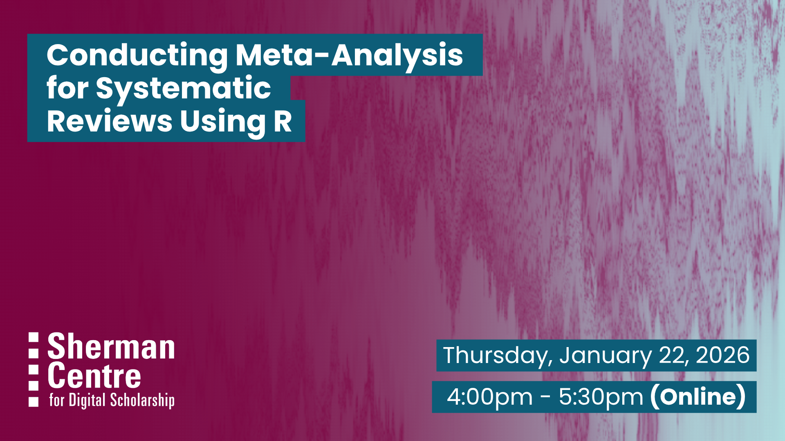

# Conducting Meta-Analysis for Systematic Reviews Using R

Are you working on a systematic review and want to take it to the next step? In this beginner-friendly workshop, we’ll walk through the essential steps to perform a meta-analysis using R, with a focus on practical application and clear interpretation. 

In this hands-on workshop, you’ll learn how to conduct a meta-analysis tailored for systematic reviews of RCTs. We’ll use R, a free, open-source statistical software, to guide you through importing data, calculating effect sizes, assessing heterogeneity, and producing forest plots. Whether you’re new to meta-analysis or just need a refresher, this session offers a practical entry point into evidence synthesis using reproducible, code-based workflows.

ln this workshop, participants will learn to:
- Run a meta-analysis and create a forest plot
- Perform subgroup analyses
- Create funnel plots for publication bias

No prior experience with meta-analysis is required. This workshop is ideal for researchers who are conducting or planning to conduct systematic reviews involving RCTs. Basic familiarity with R (e.g., running R scripts or using RStudio) is helpful but not required. we’ll provide all the code and walk through each step together.

## Workshop Preparation 

- A working copy of RStudio is required
- Participants will benefit most from the workshop if they are already conducting a systematic review, ideally at the data-extraction stage.

## Facilitator Bio

Sahar is a PhD candidate in the Health Research Methodology program at McMaster University with a background in midwifery. She supports researchers in data analysis using statistical software such as R, SAS, and SPSS, research methodology, and evidence synthesis.

## Workshop Slides

<embed src="assets/docs/MetaAnalysis_Workshop_jan.pdf" style="border:none;" width="100%" height="466px">

[Download as PDF.](assets/docs/MetaAnalysis_Workshop_jan.pdf)

## Workshop Recording

<iframe height="416" width="100%" allowfullscreen frameborder=0 src="https://echo360.ca/media/997693e4-18fb-4054-80df-5826fc55d4e8/public"></iframe>
[View original here.](https://echo360.ca/media/997693e4-18fb-4054-80df-5826fc55d4e8/public)