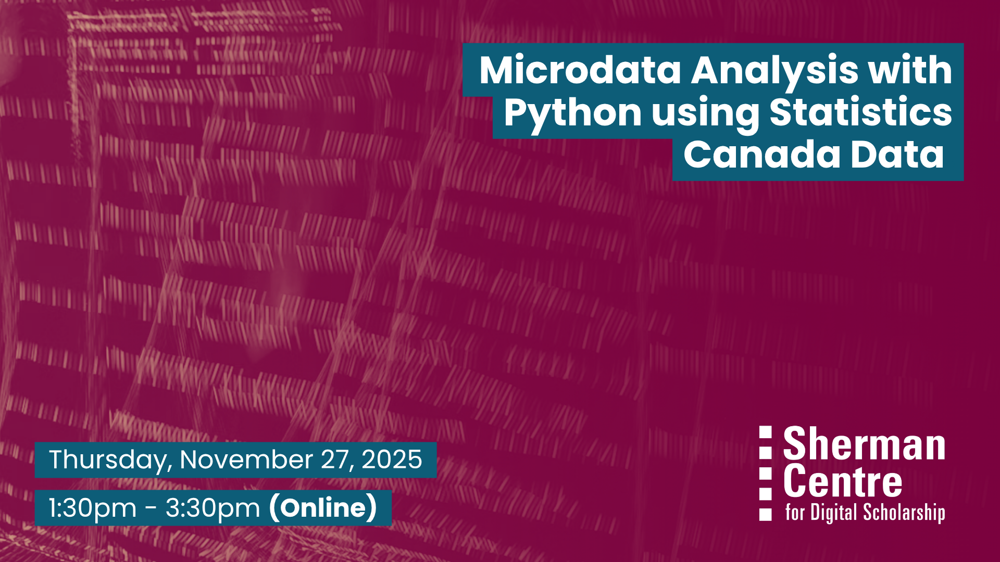

# Microdata Analysis with Python using Statistics Canada Data (Fall Term)

Interested in working with Canadian survey data? This hands-on workshop introduces participants to data analysis using Public Use Microdata Files (PUMF) from Statistics Canada’s sample surveys.

You’ll learn how to access, manage, and analyze microdata to uncover meaningful insights. Using sample datasets, we’ll walk through various statistical techniques and give you practical experience in interpreting and presenting your findings.

By the end of this session, participants will be able to:

- Locate and access Statistics Canada PUMF dataset

- Organize and manage microdata for analysis

- Apply basic statistical techniques to explore the data

- Interpret and present results with clarity and confidence

This session is ideal for students, faculty, staff, and community members interested in Canadian data—no prior experience required.

## Workshop Preparation 

McMaster participants will use their MacID to login to McMaster's Jupiter Notebook instance. Non-McMaster participants must have a tool (such as Google Colab, Kaggle Notebooks, PyCharm, Spyder etc.) ready on their system to write Python code.

## Facilitator Bio

Vivek Jadon (he/him) provides research support in the use of numeric research data. As part of his role, Vivek is McMaster University’s official representative for Statistics Canada’s Data Liberation Initiative (DLI) program and Inter-university Consortium for Political and Social Research (ICPSR). Both of these programs provide researchers with vast archive of research data from various disciplines for high quality research and instruction. Vivek is also involved in building awareness and promoting RDM activities/services at McMaster.

## Workshop Slides

<embed src="assets/docs/Microdata-Analysis-Using-Python-nov-2025.pdf" style="border:none;" width="100%" height="466px">

[Download as PDF.](assets/docs/Microdata-Analysis-Using-Python-nov-2025.pdf)

## Workshop Recording
<iframe height="416" width="100%" allowfullscreen frameborder=0 src="https://echo360.ca/media/8370da71-6e88-4aeb-95ea-ba18d2f615e5/public"></iframe> [View original here.](https://echo360.ca/media/8370da71-6e88-4aeb-95ea-ba18d2f615e5/public)
