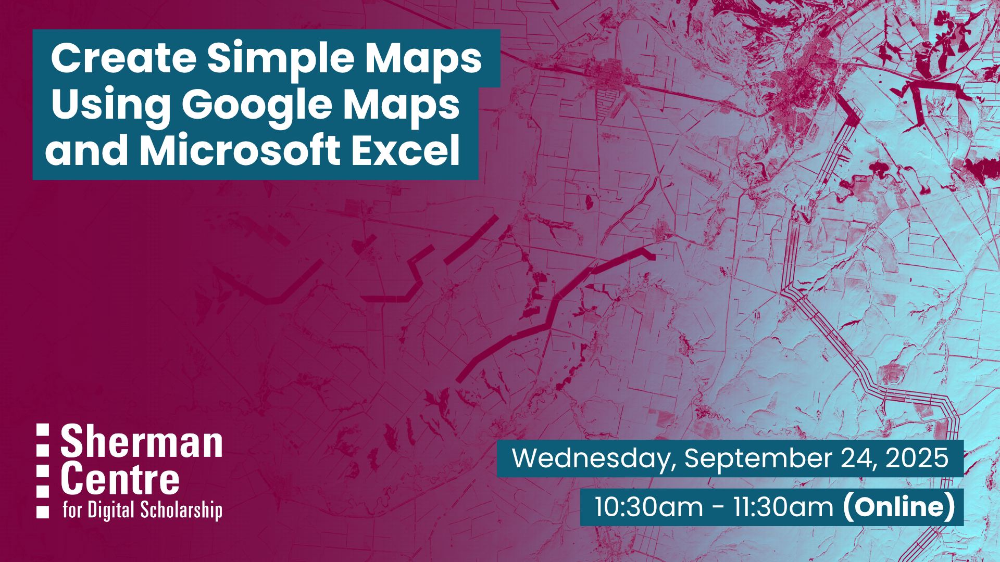

# Create Simple Maps Using Google Maps and Microsoft Excel

Want to create maps but don’t have the time, patience, or storage space for a new application? We’ve got you covered. This beginner-friendly workshop is designed to show participants how to use familiar tools like Google Maps and Microsoft Excel, to make simple maps for reports, presentations, or even a group chat. 

In this workshop, participants will: 
- Learn the basics of using Google Maps and Microsoft Excel to create and visualize spatial data
- Become familiar with spatial data
- Learn how to export maps for use in presentations, documents, and websites
- Understand common mistakes in map making.

No technical expertise is required! This session is geared toward anyone looking to learn more about digital mapping tools and techniques.

## Workshop Preparation 

Participants will require a Google Account and access to Microsoft Excel to follow along and make their own maps. Please note that you will need to download Microsoft Excel. The web version does not support the required mapping features. McMaster affiliates can <a href="[url](https://office365.mcmaster.ca/office-365-3/applications/ms-excel/#tab-content-getting-started)">download Microsoft Excel here</a>. 

## Facilitator Bio

Christine Homuth (she/her) is the Library's GIS Specialist, providing support and resources to students, researchers, and faculty members working with Geographic Information Systems (GIS) and geospatial data.

Saman’s (she/her) work operates at the intersection of information science and critical geography. She’s particularly interested in the ways in which community-owned and -governed infrastructure can contribute to equitable knowledge systems. Currently, Saman takes care of McMaster’s Lloyd Reeds Map Collection, ensuring community members are able to access, understand, and use the collection for teaching and research.

## Workshop Slides

Coming soon.

<!-- <embed src="assets/docs/Creating-and-Sharing-Maps-with-ArcGIS-Online.pdf" style="border:none;" width="100%" height="466px">

[Download as PDF.](assets/docs/Creating-and-Sharing-Maps-with-ArcGIS-Online.pdf)-->
